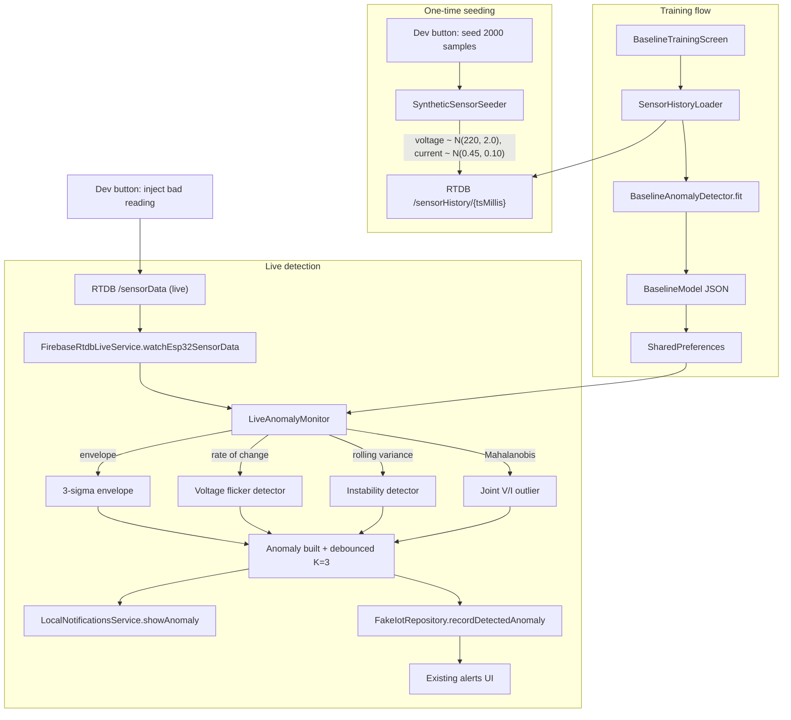

# Layered IoT Anomaly Detector — Implementation Plan

> **For Claude Code.** Execute this plan top to bottom. Every code edit must respect the existing project conventions: Riverpod for DI, Freezed (or hand-written immutable + `toJson`/`fromJson`) for models, repository pattern in `lib/skillink/data/repositories/`, services in `lib/skillink/data/services/`, screens in `lib/skillink/ui/iot_monitor/`. Use `flutter_lints`. Do **not** modify generated `*.g.dart` / `*.freezed.dart` files by hand — re-run `dart run build_runner build --delete-conflicting-outputs` if needed. The dev environment runs with `kUseFakeRepositories = true` (see `lib/skillink/data/providers.dart:62`), so the `FakeIotRepository` is the active path.

## Goal

Replace the hardcoded thresholds in `lib/skillink/ui/iot_monitor/widgets/appliance_detail_screen.dart` (lines 189-206, `> 240V` / `> 8A`) with a **trained, multi-layer anomaly detector** whose model is learned from 3 days (2000 samples) of voltage/current data persisted on Firebase RTDB. The detector runs against the existing `watchEsp32SensorData()` stream and feeds the existing `LocalNotificationsService.showAnomaly()` and alerts screen unchanged.

The four detection layers, in priority order:

1. **3σ Envelope** — voltage / current outside `[μ - 3σ, μ + 3σ]`. Catches hard out-of-band readings.
2. **Rate-of-change** — `|Δv|/Δt` exceeds the learnt distribution of changes. Catches flicker / arcing / brownouts that simple thresholds miss.
3. **Rolling-window variance** — live σ over the last 30 samples vs learnt σ. Catches in-band oscillation / instability.
4. **Mahalanobis distance** on the joint `(V, I)` distribution — catches points that are individually in-range but jointly anomalous (e.g. nominal voltage with no expected load draw, or nominal current with abnormal voltage drop).

A reading is anomalous if **any** layer fires, debounced by K=3 consecutive verdicts of the same type with a 60-second per-type cooldown.

## Architecture



## Existing infrastructure to reuse (do not duplicate)

- `lib/skillink/data/services/firebase_rtdb_live_service.dart` — `watchEsp32SensorData()` already streams `SensorReading` from `sensorData` path. Extend it (don't replace) with a write helper.
- `lib/skillink/data/services/local_notifications_service.dart` — `showAnomaly(Anomaly)` is already wired and creates the channel. Just add new `type` cases to `_titleFor` (line 188-197).
- `lib/skillink/testing/fakes/fake_iot_repository.dart` — already maintains `_anomalies`, `_anomalyStream`, and calls `_notifications?.showAnomaly`. Add a single `recordDetectedAnomaly` method that mirrors `simulateAnomaly` (lines 174-203) **without** re-firing the notification (the monitor fires it).
- `lib/skillink/domain/models/anomaly.dart` and `lib/skillink/domain/models/sensor_reading.dart` — Freezed models, do not modify.
- `lib/skillink/ui/iot_monitor/widgets/anomaly_visuals.dart` — central icon/title/severity registry. Add new types here.
- `lib/skillink/data/providers.dart` — Riverpod providers. Add new ones; do not break the existing `iotRepositoryProvider` switch on `kUseFakeRepositories`.

## Files to add

### 1. `lib/skillink/data/services/baseline_anomaly_detector.dart` (~180 LOC)

Pure math, no I/O. Two public types:

**`BaselineModel`** (immutable; hand-written `toJson` / `fromJson` is fine — no need to invoke `build_runner` for this file):

- `voltageMean, voltageStd, voltageP01, voltageP99, voltageMaxRate`
- `currentMean, currentStd, currentP01, currentP99, currentMaxRate`
- `covVV, covVI, covII` (2x2 covariance for Mahalanobis); store inverse pre-computed: `invCovVV, invCovVI, invCovII`
- `mahalanobisChi2Threshold` — default `9.21` (χ² critical value for 2 DOF at p=0.99)
- `sampleCount, trainedAt: DateTime, trainingDurationMs`

**`BaselineAnomalyDetector`**:

- `static BaselineModel fit(List<SensorReading> samples)`
  - Single pass: running sums for mean, M2 (Welford) for std.
  - Sorted-copy P01 / P99 percentile.
  - Per-step `Δ/Δt` for the max-rate distribution (use the 99th percentile of `|Δv|/Δt` as `voltageMaxRate`, same for current).
  - 2x2 covariance: `covVV = Σ(v-μv)²/n`, `covVI = Σ(v-μv)(i-μi)/n`, `covII = Σ(i-μi)²/n`.
  - Closed-form 2x2 inverse: `det = covVV·covII - covVI²; invCovVV = covII/det; invCovII = covVV/det; invCovVI = -covVI/det`. Guard `det <= 1e-9` by adding a small ridge (`covVV += 1e-6; covII += 1e-6`).

- `AnomalyVerdict? evaluate(SensorReading reading, DetectorState state)`
  - Layer 1 (envelope):
    - `voltage > μv + 3σv` → `('voltage_spike', 'high')`
    - `voltage < μv - 3σv` → `('voltage_sag', 'high')`
    - `current > μi + 3σi` → `('current_surge', 'high')`
    - `current < μi - 3σi` → `('current_drop', 'medium')`
  - Layer 2 (rate-of-change), needs `state.lastReading`:
    - `dt = (reading.timestamp - last.timestamp).inMilliseconds / 1000.0`; if `dt <= 0`, skip.
    - `|Δv|/dt > model.voltageMaxRate * 1.5` → `('voltage_flicker', 'medium')`
  - Layer 3 (rolling variance), needs `state.ringBuffer` (capacity 30):
    - Push reading. Once `length == 30`, compute σ. If `liveStd > 3 * model.voltageStd` → `('voltage_instability', 'medium')`.
  - Layer 4 (Mahalanobis):
    - `dv = v - μv; di = i - μi`
    - `d² = dv*dv*invCovVV + 2*dv*di*invCovVI + di*di*invCovII`
    - `d² > 9.21` → `('abnormal_load_pattern', 'high')`
  - Return the **first** layer that fires (priority order above), or `null`.

**`AnomalyVerdict`**: `(String type, String severity, String message)`. Build the message inline including the actual value vs the learnt threshold, e.g. `'Voltage instability detected (σ_live=8.4V vs learnt σ=2.1V)'` — strong demo talking point.

**`DetectorState`**: holds `SensorReading? lastReading` and a `Queue<double> voltageRingBuffer` (cap 30). Constructed fresh per `LiveAnomalyMonitor.start()`.

### 2. `lib/skillink/data/services/baseline_model_storage.dart` (~40 LOC)

```dart
class BaselineModelStorage {
  static const _key = 'iot.baseline_model.v1';
  Future<BaselineModel?> load();
  Future<void> save(BaselineModel m);
  Future<void> clear();
}
```

Encode model as a single JSON string in `SharedPreferences`.

### 3. `lib/skillink/data/services/synthetic_sensor_seeder.dart` (~70 LOC)

Wire to RTDB the same way as `FirebaseRtdbLiveService`:

```dart
final app = Firebase.app();
final database = FirebaseDatabase.instanceFor(
  app: app,
  databaseURL: AppConstants.firebaseRtdbUrl,
);
final ref = database.ref().child('sensorHistory');
```

API:

```dart
Stream<SeederProgress> seed({
  int sampleCount = 2000,
  Duration spanBack = const Duration(hours: 72),
});
```

For each sample (loop 2000 times):

- `t = now.subtract(Duration(milliseconds: rng.nextInt(spanBack.inMilliseconds)))`. Sort all timestamps ascending before pushing so the chart timeline is monotonic.
- `voltage = clamp(220 + gaussian(0, 2.0), 212, 230)`
- `current = clamp(0.45 + gaussian(0, 0.10), 0.10, 0.95)` — strict `< 1A` per the user's constraint.
- `power = voltage * current`
- Push to `sensorHistory/{tMillis}` with payload `{ voltage, current, power, timestamp: tMillis }`.

Use `ref.update({ for each batch })` in **batches of 50** for throughput. After each batch, yield `SeederProgress(written, total)`.

`gaussian(mean, std)` via Box-Muller: `mean + std * sqrt(-2 * ln(u1)) * cos(2π * u2)` where `u1, u2` are `rng.nextDouble()`.

### 4. `lib/skillink/data/services/sensor_history_loader.dart` (~50 LOC)

```dart
Stream<TrainingLoadProgress> load();
```

- `await ref.child('sensorHistory').orderByKey().get();`
- Parse children into `List<SensorReading>` (re-use the `_parseValue` shape from `firebase_rtdb_live_service.dart:23-66`; refactor it to a top-level static helper that both files share).
- Emit progress as samples are parsed (every 100). Final emission carries `samples: List<SensorReading>`.

### 5. `lib/skillink/data/services/live_anomaly_monitor.dart` (~120 LOC)

```dart
class LiveAnomalyMonitor {
  LiveAnomalyMonitor({ ... });
  Future<void> start();
  Future<void> stop();
}
```

Owns:

- A subscription to `_rtdb.watchEsp32SensorData()`.
- A `BaselineModel?` (re-loaded when storage notifies; the simplest wiring is `_ref.listen(baselineModelProvider, ...)` from a `Provider<LiveAnomalyMonitor>`).
- A `DetectorState` (fresh per `start()`).
- A `Map<String, int>` of consecutive-fire counters per type (debounce, K=3).
- A `Map<String, DateTime>` of last-fire-timestamps per type (cooldown, 60s).

Per incoming reading:

1. If `model == null`, ignore.
2. `verdict = detector.evaluate(reading, state)`. If `null`, decay all counters by 1; continue.
3. Increment the counter for `verdict.type`. If `< 3`, continue.
4. If last-fire for that type was `< 60s` ago, continue.
5. Build an `Anomaly`:
   - `id = 'an_${DateTime.now().microsecondsSinceEpoch}'`
   - `applianceId` — use the first appliance whose `iotDeviceId == AppConstants.firebaseEsp32SensorDataDeviceId` from `iotRepository.getAppliances()`; cache the lookup once per `start()`.
   - `applianceName` — friendly name from that appliance.
   - `type`, `severity`, `message` from verdict.
   - `suggestedTrade = 'electrician'`.
6. `await _iot.recordDetectedAnomaly(anomaly)` then `await _notifications.showAnomaly(anomaly)`.
7. Reset the counter, set last-fire-timestamp.

### 6. `lib/skillink/ui/iot_monitor/view_models/baseline_training_view_model.dart` (~150 LOC)

Riverpod `StateNotifier<TrainingState>`. State shape:

```dart
enum TrainingPhase { idle, seeding, loading, fitting, done, error }

class TrainingState {
  TrainingPhase phase;
  int progress;
  int total;
  BaselineModel? model;
  List<SensorReading>? loadedSamples; // for the chart preview
  String? errorMessage;
}
```

Methods:

- `Future<void> seedTrainingData()` — drives `SyntheticSensorSeeder.seed()`, mirrors progress.
- `Future<void> trainFromRtdb()` — drives `SensorHistoryLoader.load()` then `BaselineAnomalyDetector.fit()` (run via `compute()` if it ever gets too slow on-device; for 2000 samples this is sub-100ms so direct call is fine).
- `Future<void> activate()` — `BaselineModelStorage.save(model)` then `ref.invalidate(baselineModelProvider)` so the live monitor picks it up immediately.

### 7. `lib/skillink/ui/iot_monitor/widgets/baseline_training_screen.dart` (~300 LOC)

Layout (top to bottom in a `ListView`):

1. **Top card** — title "Statistical baseline anomaly detector", three-line explainer copy.
2. **Phase chips** — three rounded chips Day 1 / Day 2 / Day 3, animating to a green checkmark as `progress / total` crosses 1/3, 2/3, 3/3. Purely visual.
3. **Voltage chart (the killer chart)** — `fl_chart` `LineChart` of `state.loadedSamples` voltage over index. Overlay:
   - A translucent green band between `model.voltageMean - 3*voltageStd` and `model.voltageMean + 3*voltageStd` using `BarAreaData` or two `LineChartBarData` with fill.
   - Two dashed red horizontal lines at `voltageP01` and `voltageP99`.
   - Rebuilds incrementally as fitting completes.
4. **Stats grid** — 3x3 of `μ_V, σ_V, P01_V, P99_V, μ_I, σ_I, max ΔV/s, sample count, training time`. Use `AppTypography.mono` to match the existing `_StatsCard` look in `appliance_detail_screen.dart`.
5. **Mahalanobis ellipse mini-chart** (the wow element) — `fl_chart` `ScatterChart`. V on x-axis, I on y-axis. Plot **400 evenly-spaced** training points (downsample to keep it fast). Draw the 99% confidence ellipse using ~60 sampled points around the eigenvector basis of the covariance matrix:
   - Eigenvalues of 2x2 `Σ`: `tr = covVV + covII`, `det = covVV*covII - covVI²`, `λ1 = tr/2 + sqrt((tr/2)² - det)`, `λ2 = tr/2 - sqrt((tr/2)² - det)`.
   - Eigenvector angle: `θ = atan2(2*covVI, covVV - covII) / 2`.
   - For `t = 0 .. 2π` step `2π/60`: `(x, y) = μ + R(θ) · diag(√(9.21*λ1), √(9.21*λ2)) · (cos t, sin t)`.
   - Render the 60 points as a thin connected line via a second `LineChartBarData` overlay. (If `fl_chart` doesn't let you mix LineChart and ScatterChart trivially, render the ellipse as small dot scatter points — same effect.)
6. **Buttons**:
   - `Seed 3 days of training data` — gated by `AppConstants.showSimulateAnomalyButton` (already true; see `app_constants.dart:110`).
   - `Train baseline`.
   - `Save & activate monitoring` — disabled until `state.model != null`.

Wire the screen behind `Routes.iotTraining` (see step F below).

### 8. Hidden dev injector

Add `Future<void> writeOneShotReading({required double voltage, required double current})` to `FirebaseRtdbLiveService` that writes `{voltage, current, power: v*i, timestamp: nowMillis}` to `sensorData` (the live path).

Helper methods on the same service:

- `Future<void> injectVoltageSpike()` → `writeOneShotReading(voltage: 248, current: 0.45)`.
- `Future<void> injectVoltageFlicker()` → 5 alternating writes `215 ↔ 232` over 3 s (`Future.delayed(600ms)` between each).
- `Future<void> injectLoadAnomaly()` → `writeOneShotReading(voltage: 220, current: 1.6)` (in-range voltage but joint-distribution outlier — the Mahalanobis demo).

Surface via a bottom sheet opened from the long-press handler currently at `appliances_list_screen.dart:330-334` (`_toggleFakeCurrentDemo`). Replace that handler with `_showDevSheet(context, ref)`. The sheet contains:

- "Seed 3 days of training data" → `SyntheticSensorSeeder.seed()` (with a progress dialog).
- "Inject voltage spike" / "Inject voltage flicker" / "Inject load anomaly".
- The existing fake-amps toggle (preserve the `esp32LiveMonitorFakeCurrentProvider` behaviour).

## Files to modify

### A. `lib/skillink/data/repositories/iot_repository.dart`

Add to the abstract class:

```dart
void recordDetectedAnomaly(Anomaly anomaly);
```

### B. `lib/skillink/testing/fakes/fake_iot_repository.dart`

Implement `recordDetectedAnomaly` exactly like `simulateAnomaly` (lines 197-198) but **without** the `_notifications?.showAnomaly(anomaly)` call:

```dart
@override
void recordDetectedAnomaly(Anomaly anomaly) {
  _anomalies.insert(0, anomaly);
  if (!_anomalyStream.isClosed) _anomalyStream.add(anomaly);
}
```

### C. `lib/skillink/data/repositories/remote_iot_repository.dart`

Stub `recordDetectedAnomaly` with a `debugPrint` only — real backend integration is out of scope.

### D. `lib/skillink/data/providers.dart`

Add (place near the existing `iotRepositoryProvider` at line 397):

```dart
final baselineModelStorageProvider = Provider<BaselineModelStorage>(
  (ref) => BaselineModelStorage(),
);

final baselineModelProvider = FutureProvider<BaselineModel?>((ref) async {
  return ref.watch(baselineModelStorageProvider).load();
});

final syntheticSensorSeederProvider = Provider<SyntheticSensorSeeder>(
  (ref) => SyntheticSensorSeeder(),
);

final sensorHistoryLoaderProvider = Provider<SensorHistoryLoader>(
  (ref) => SensorHistoryLoader(),
);

final liveAnomalyMonitorProvider = Provider<LiveAnomalyMonitor>((ref) {
  final monitor = LiveAnomalyMonitor(
    rtdb: ref.watch(firebaseRtdbLiveServiceProvider),
    iot: ref.watch(iotRepositoryProvider),
    notifications: ref.watch(localNotificationsServiceProvider),
    ref: ref,
  );
  ref.onDispose(monitor.stop);
  return monitor;
});

final liveAnomalyMonitorBindingProvider = Provider<void>((ref) {
  final model = ref.watch(baselineModelProvider).valueOrNull;
  final monitor = ref.watch(liveAnomalyMonitorProvider);
  if (model != null) {
    unawaited(monitor.start());
  } else {
    unawaited(monitor.stop());
  }
});
```

### E. `lib/main.dart`

In `SkillChainApp.build` alongside the existing bindings (currently lines 69-71):

```dart
ref.watch(fcmBindingProvider);
ref.watch(completionPromptBindingProvider);
ref.watch(workerLiveLocationBindingProvider);
ref.watch(liveAnomalyMonitorBindingProvider); // NEW
```

### F. `lib/skillink/routing/routes.dart` and `lib/router/app_router.dart`

In `routes.dart`, add:

```dart
static const iotTraining = '/iot/training';
```

In `app_router.dart`, register a `GoRoute` next to the existing `applianceDetail` / `alerts` routes around line 547-567:

```dart
GoRoute(
  path: Routes.iotTraining,
  name: 'iotTraining',
  builder: (_, __) => const BaselineTrainingScreen(),
),
```

### G. `lib/skillink/ui/iot_monitor/widgets/appliance_detail_screen.dart`

In `_GaugesRow.build` (lines 183-219), accept an optional `BaselineModel? model` and replace the hardcoded thresholds:

```dart
isAnomalous: model != null
    && reading != null
    && (reading.voltage > model.voltageMean + 3 * model.voltageStd
        || reading.voltage < model.voltageMean - 3 * model.voltageStd),
```

Same shape for current (`> μ + 3σ` or `< μ - 3σ`).

Pass the model into `_GaugesRow` from the parent, sourced via:

```dart
final model = ref.watch(baselineModelProvider).valueOrNull;
```

If a model exists, also widen the gauges' `minValue` / `maxValue` to `[model.voltageP01 - 5, model.voltageP99 + 5]` and `[max(0, model.currentP01 - 0.05), model.currentP99 + 0.1]` so the visual zone reflects the learnt envelope.

### H. `lib/skillink/data/services/local_notifications_service.dart`

Extend `_titleFor` (line 188-197) with:

```dart
'voltage_sag' => 'Voltage drop detected',
'voltage_flicker' => 'Voltage flicker detected',
'voltage_instability' => 'Voltage instability detected',
'current_drop' => 'Unexpected load drop detected',
'abnormal_load_pattern' => 'Abnormal load pattern detected',
```

### I. `lib/skillink/ui/iot_monitor/widgets/anomaly_visuals.dart`

Add icon, title, and severity colour entries for the same five new types. Match the existing palette (e.g. flicker → `Icons.bolt_rounded` warning amber; instability → `Icons.show_chart_rounded`; abnormal load → `Icons.scatter_plot_rounded` red).

### J. `lib/skillink/ui/iot_monitor/widgets/appliances_list_screen.dart`

- Add a status pill above the appliance grid (above the `_Esp32RtdbLiveCard`):
  - When `baselineModelProvider` value is `null`: `Train baseline model →` (tap routes to `Routes.iotTraining`).
  - When loaded: `Model trained on ${m.sampleCount} samples · ${friendlyAge(m.trainedAt)}` with a "Retrain" trailing action.
- Replace the long-press handler at line 332 (`_toggleFakeCurrentDemo`) with `_showDevSheet(context, ref)` exposing: `Seed 3 days`, `Inject spike`, `Inject flicker`, `Inject load anomaly`, plus the existing fake-amps toggle.

## Demo script for tomorrow

1. Open app → Live Monitor.
2. Long-press the sensor icon → tap **Seed 3 days of training data** → progress runs to 2000/2000 (~15-30 s depending on RTDB latency).
3. Tap **Train baseline model** in the status pill → training screen opens, the Day 1/2/3 chips tick, the line chart fills in with the green envelope band, the scatter chart paints the Mahalanobis ellipse, stats grid populates. Tap **Save & activate monitoring**.
4. Back on Live Monitor → long-press icon again → tap **Inject voltage spike** (or flicker, or load anomaly).
5. ~1-2 seconds later (after K=3 debounce) the local notification fires. Tap it → alert detail → Book technician.
6. Talking points ready: 3σ envelope (Chebyshev / 68-95-99.7), rate-of-change detector, rolling-window variance for in-band instability, Mahalanobis on the joint V/I distribution for outliers that are individually in-range, K=3 debounce + 60 s cooldown to suppress false alarms.

## Risks & fallbacks

- **RTDB write rules block client-side seeding** → fallback to writing a JSON asset bundled in `assets/training_data.json` and shipping with `pubspec.yaml`. The training screen reads from the asset instead of RTDB. Story changes from "loaded from Firebase" to "loaded from on-device 3-day capture" — still defensible.
- **`fl_chart` ScatterChart with 2000 dots is slow on first paint** → downsample to 400 evenly-spaced points for the visual; train on all 2000.
- **`firebase_database` write API differs from your snippet** → use `ref.set({ ... })` per child or `ref.update({ '/sensorHistory/$tMillis': payload })` from the parent ref; either works.
- **Time runs out before the Mahalanobis chart** → ship layers 1+2+3 only; the scatter ellipse is the last item on the implementation list and is purely demo polish.

## Implementation order (minimise rebuild thrash)

1. Detector + model + storage (pure code, no UI). Compiles standalone.
2. Repository extension + providers wiring.
3. Live monitor + main wiring.
4. Notifications + visuals copy edits for new types.
5. Seeder + dev injector sheet.
6. Training screen.
7. Replace gauges thresholds.
8. End-to-end smoke test on device.

## TODO checklist

- [ ] **detector** — Add `BaselineAnomalyDetector` + `BaselineModel` (4-layer math: envelope, rate-of-change, rolling variance, Mahalanobis) in `lib/skillink/data/services/baseline_anomaly_detector.dart`.
- [ ] **storage** — Add `BaselineModelStorage` (`SharedPreferences`) and corresponding Riverpod providers.
- [ ] **repo-ext** — Extend `IotRepository` with `recordDetectedAnomaly` and implement on `FakeIotRepository` / stub on `RemoteIotRepository`.
- [ ] **monitor** — Add `LiveAnomalyMonitor` wiring `watchEsp32SensorData` → detector → debounce K=3 + 60 s cooldown → repo + notifications.
- [ ] **main-wire** — Wire monitor start/stop into `main.dart` via a binding provider (alongside `fcmBinding` etc.).
- [ ] **notif-titles** — Extend `LocalNotificationsService._titleFor` and `AnomalyVisuals` with five new anomaly types (`voltage_sag`, `voltage_flicker`, `voltage_instability`, `current_drop`, `abnormal_load_pattern`).
- [ ] **seeder** — Add `SyntheticSensorSeeder` that pushes 2000 samples (V~N(220, 2), I~N(0.45, 0.10), I<1A) to RTDB `sensorHistory` across the past 72 h with progress stream.
- [ ] **loader** — Add `SensorHistoryLoader` that reads `sensorHistory` back as `List<SensorReading>` with progress.
- [ ] **dev-injector** — Add `writeOneShotReading` helpers and a dev-injector bottom sheet exposing Seed / Inject spike / Inject flicker / Inject load anomaly buttons.
- [ ] **training-vm** — Add `BaselineTrainingViewModel` orchestrating seed → load → fit → save with `TrainingState` phases.
- [ ] **training-screen** — Add `BaselineTrainingScreen`: phase chips, voltage line chart with envelope band, Mahalanobis scatter ellipse, stats grid, Save & Activate button.
- [ ] **routes** — Add `Routes.iotTraining` and register `GoRoute` in `app_router.dart`.
- [ ] **gauges** — Replace hardcoded `> 240V` / `> 8A` thresholds in `appliance_detail_screen.dart` with model-driven envelope + widen gauge ranges to learnt P01/P99.
- [ ] **list-pill** — Add status pill on Live Monitor list screen showing model state and routing to `/iot/training`, and rebuild the long-press handler into the dev sheet.
- [ ] **smoke-test** — End-to-end smoke test: seed → train → activate → inject spike → notification → alert detail.
